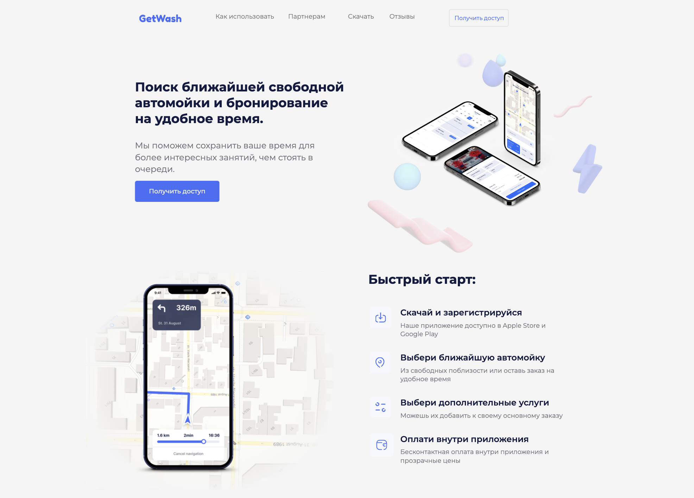
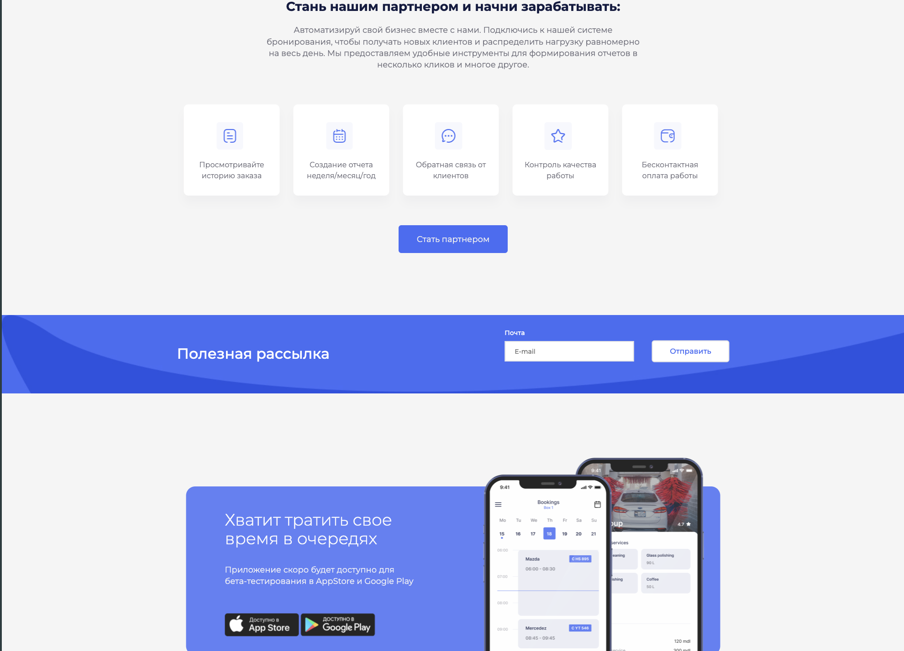

# Get Wash
Одностраничник адаптируемый на разные разрешения экрана был преимущественно использован boostrap с модулем scss.
## Технологии

## Gallery

  
  

[Figma](https://www.figma.com/file/jQ4cfanZXfDBmsXOyDh6ol/Realco-project?type=design&node-id=8-62&mode=design&t=5bN43qYv8CAcgQSP-0)
